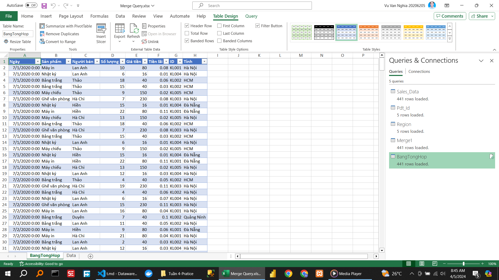
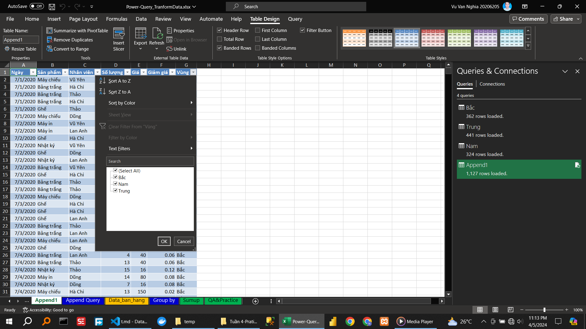
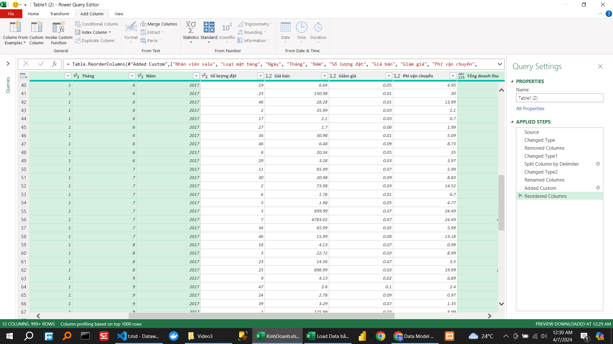
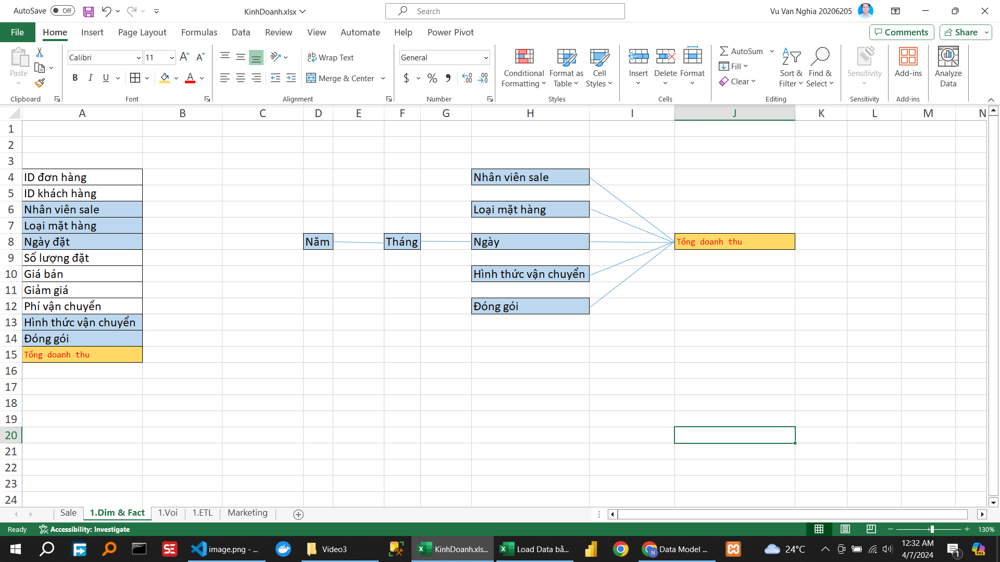
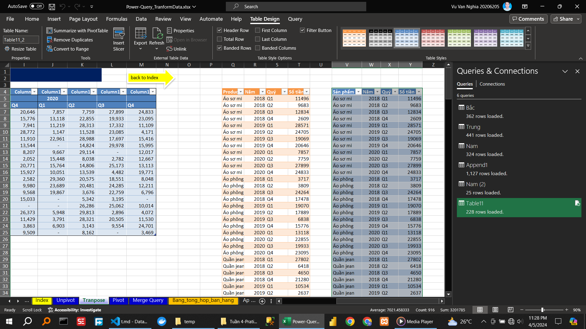

\subsubsection{Video 2}

\caption{Hướng dẫn chuyển đổi dữ liệu Merge Query}

\caption{Hướng dẫn chuyển đổi dữ liệu Append Query}

\caption{Hướng dẫn chuyển đổi dữ liệu Group by}

\caption{Hướng dẫn chuyển đổi dữ liệu Unpivot}

\caption{Hướng dẫn chuyển đổi dữ liệu Tranpose}

\caption{Hướng dẫn chuyển đổi dữ liệu Pivot}

<!--  -->

\caption{Hướng dẫn xxxxxxxxxxxxxxxxxxxxxx}

\caption{Thực hành xxxxxxxxxxxxxxxxxxxxxx}

<!--  -->
<!--  -->
<!--  -->
<!--  -->
<!--  -->
<!--  -->
<!--  -->
<!--  -->
<!--  -->
<!--  -->
<!--  -->

Thực hành 5.1: Power Query & Dash
PHÂN TÍCH
B1. Đọc dashboard, phân tích 👉 comment kết quả
B2. Xác định các chiều (DIM), các các yếu tố phân tích (FACT)👉 comment kết quả
B3. Sử dụng công cụ Remove Duplicate để tạo ra con voi khái niệm các chiều.👉 comment kết quả
Chúc các bạn học tốt ❤
https://www.youtube.com/watch?v=0pGY92wHzWE
link file thực hành:
1P/view?fbclid=IwAR2tQ-VVfxDOZlIrTiynHgI4n84I3D6vW1buRLCTi8FnOgvZnfkyihrjT1s

<!--  -->

Thực hành 5.2: XÂY DỰNG DASHBOARD TRÊN GOOGLE DATA STUDIO
Các bạn thực hành 3 video đầu tiên và comment ảnh kết quả vào bài viết này để mình góp ý nhé!
Đây là danh sách video học Data visual studio.
https://www.youtube.com/watch?v=1qGsjmmHiu8...
