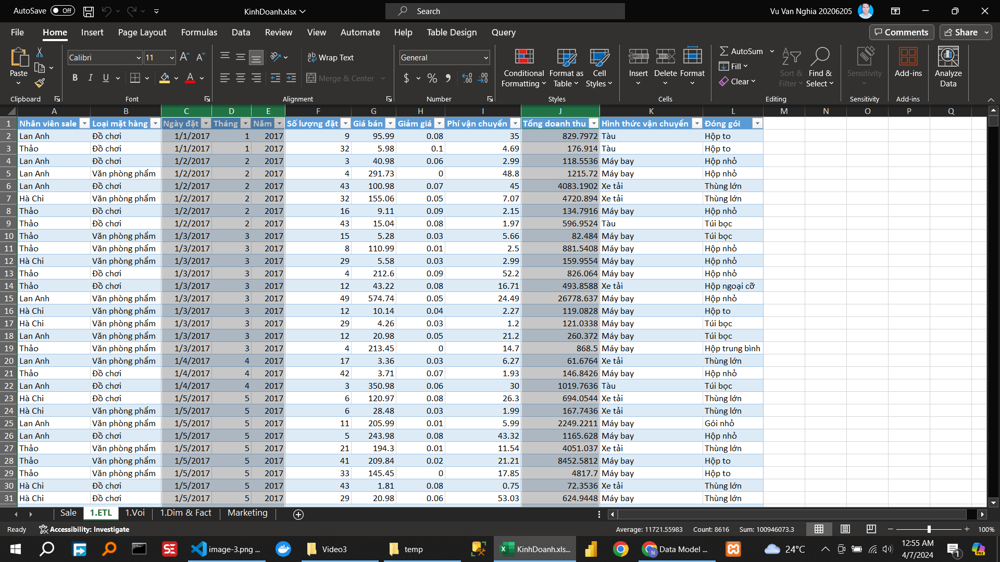

\textbf{Câu hỏi:}   Bài tập cơ bản: Thực hành với sheet Sale của file KinhDoanh.xlsx:
<!-- \bengin -->
<!-- \bengin --> caption
<!-- \bengin --> caption
<!-- \bengin --> caption
<!-- \bengin --> caption

<!-- 1. ETL dữ liệu -->

<!-- 2. Viết requirement -->
Phân tích về doanh thu trên khía cạnh thời gian.

<!-- 3. Lên bảng danh mục các cột (vẽ voi) -->

<!-- 4. Phân tích Dim & Fact -->

<!-- 5. Vẽ data model -->
<!-- !     diagram -->

<!-- ! Bài tập nâng cao: Thực hành với sheet Sale và sheet Marketing của file KinhDoanh.xlsx: -->
\textbf{Câu hỏi:}  Bài tập nâng cao: Thực hành với sheet Sale và sheet Marketing của file KinhDoanh.xlsx:
<!-- ! Bài tập nâng cao: Thực hành với sheet Sale và sheet Marketing của file KinhDoanh.xlsx: -->
<!-- ! Bài tập nâng cao: Thực hành với sheet Sale và sheet Marketing của file KinhDoanh.xlsx: -->
<!-- ! Bài tập nâng cao: Thực hành với sheet Sale và sheet Marketing của file KinhDoanh.xlsx: -->
<!-- ! Bài tập nâng cao: Thực hành với sheet Sale và sheet Marketing của file KinhDoanh.xlsx: -->
<!-- ! Bài tập nâng cao: Thực hành với sheet Sale và sheet Marketing của file KinhDoanh.xlsx: -->
<!-- ! Bài tập nâng cao: Thực hành với sheet Sale và sheet Marketing của file KinhDoanh.xlsx: -->

<!-- 1. ETL dữ liệu (Merge 2 sheet với nhau) -->

<!-- 2. Viết requirement -->

<!-- 3. Lên bảng danh mục các cột (vẽ voi) -->

<!-- 4. Phân tích Dim & Fact -->

<!-- 5. Vẽ data model -->

<!-- !\subsubsection{Video 4} -->
<!-- !\subsubsection{Video 4} -->
<!-- !\subsubsection{Video 4} -->
<!-- !\subsubsection{Video 4} -->
<!-- !\subsubsection{Video 4} -->
<!-- !\subsubsection{Video 4} -->
<!-- !\subsubsection{Video 4} -->
<!-- !\subsubsection{Video 4} -->
<!-- !\subsubsection{Video 4} -->

\caption{Hướng dẫn thực hiện Add index column}

\caption{Hướng dẫn thực hiện Add duplicate column}

\caption{Hướng dẫn thực hiện Add conditional column}

\caption{Hướng dẫn thực hiện Add custom column}

\caption{Hướng dẫn thực hiện Add column bằng Invoke function}

Hãy sử dụng các thao tác Add Column, Group By để làm ví dụ sau:
Nếu Sản phẩm là Máy in, Máy chiếu thì nó thuộc loại Thiết bị, còn lại sẽ thuộc loại Dụng cụ
Nếu nhân viên bán được trên 650 dụng cụ hoặc 450 thiết bị thì sẽ được thưởng 2% lương
Ngược lại thì sẽ được thưởng 1% lương

Ngày Sản phẩm Người bán Số lượng Giá tiền Tiền lãi
7/1/2020 Máy in Lan Anh 10 80 8%
7/1/2020 Bảng trắng Thảo 18 40 6%

Loại Người bán Số lượng tổng Thưởng
Dụng cụ Duyên 705 0.02
Dụng cụ Hiền 744 0.02

<!-- !\subsubsection{Video 5} -->
<!-- !\subsubsection{Video 5} -->
<!-- !\subsubsection{Video 5} -->
<!-- !\subsubsection{Video 5} -->
<!-- !\subsubsection{Video 5} -->
<!-- !\subsubsection{Video 5} -->
<!-- !\subsubsection{Video 5} -->
<!-- !\subsubsection{Video 5} -->
<!-- !\subsubsection{Video 5} -->
<!-- !\subsubsection{Video 5} -->
<!-- !\subsubsection{Video 5} -->
<!-- !\subsubsection{Video 5} -->

<!--  -->

\caption{Hướng dẫn xxxxxxxxxxxxxxxxxxxxxx}

\caption{Thực hành xxxxxxxxxxxxxxxxxxxxxx}
